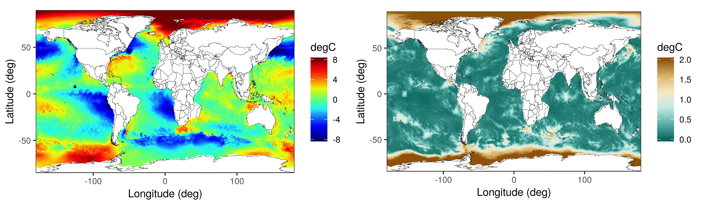

# Multi-Scale Process Modelling and Distributed Computation for Spatial Data

This GitHub page provides code for reproducing the results in the manuscript titled *Multi-Scale Process Modelling and Distributed Computation for Spatial Data* by A. Zammit-Mangion and J. Rougier. The manuscript describes the use of parallel computation, through graph colouring, to fit and predict with big spatial data. At the centre of the method is a multi-scale, hierarchical, process model and a parallel Gibbs sampler.

The two figures below depict the global SST prediction (left) and prediction standard error (right) using the multi-scale process model on 1 million SST observations from the VIIRS instrument. These maps are generated from high-dimensional distributions using a Gibbs sampling algorithm. The smallest scale on which the process is defined contains a traingulation with approximately one million vertices.

  

    
  

## Instructions

To reproduce the results of Section 5 in the manuscript please download this repository and then create a local folder on your machine (e.g., ~/cache) which will sort all the intermediate computations and the results. IMPORTANT: Change the "cache_folder.txt" file in the scripts/ folder to identify the folder you have just created. Then set your working directory to the "scripts" folder. and cycle through the R sripts in the "scripts" folder in numerical order. The code populates the img/ directory, as well as the local directory (e.g., ~/cache) which you created earlier with images and intermediate quantities.

## Abstract

  Recent years have seen a huge development in spatial modelling and prediction methodology, driven by the increased availability of remote-sensing data and the reduced cost of distributed-processing technology. It is well known that modelling and prediction using infinite-dimensional process models is not possible with large data sets, and that both approximate models and, often, approximate-inference methods, are needed. The problem of fitting simple global spatial models to large data sets has been solved through the likes of multi-resolution approximations and nearest-neighbour techniques. Here we tackle the next challenge, that of fitting complex, nonstationary, multi-scale models to large data sets. We propose doing this through the use of superpositions of spatial processes with increasing spatial scale and increasing degrees of nonstationarity. Computation is facilitated through the use of Gaussian Markov random fields and parallel Markov chain Monte Carlo based on graph colouring. The resulting model allows for both distributed computing and distributed data. Importantly, it provides opportunities for genuine model and data scalability and yet is still able to borrow strength across large spatial scales. We illustrate a two-scale version on a data set of sea-surface temperature containing on the order of one million observations, and compare our approach to state-of-the-art spatial modelling and prediction methods.

## Data

1. The land boundaries used in generating the ocean mesh were obtained from the reproducible scripts of Simpson et al. (2016), which can be downloaded from [here](http://www.r-inla.org/examples/case-studies/simpson2011). We include them in the data/meshes folder here for completeness.

2. The raw VIIRS data used in the experiment were provided by Yuliya Marchetti from the Jet Propulsion Laboratory (JPL), and comprises over 200 million observations for the day in question. Since it is is too large (4.3GB) to be included here, I have made it available in CSV format [here](https://hpc.niasra.uow.edu.au/azm/SST_data.csv). This CSV file was extracted from a BIN file using a Python "datareader" script written by Yuliya. Those who wish access to the raw BIN file and Python scripts are kindly asked to contact me in person.

### R

R 3.6.1

  xtable_1.8-4        verification_1.42   dtw_1.21-3
   proxy_0.4-23        CircStats_0.2-6     MASS_7.3-51.4
   boot_1.3-22         tidyr_1.0.0         spNNGP_0.1.3
  RANN_2.6.1          Formula_1.2-3       coda_0.19-3
  LatticeKrig_8.4     FRK_0.2.2           gridExtra_2.3
  spam64_2.5-1        gtools_3.8.1        futile.logger_1.4.3
  sparseinv_0.1.3     reshape2_1.4.3      dplyr_0.8.3
  igraph_1.2.4.2      ggplot2_3.2.1       fields_10.2
  maps_3.3.0          spam_2.5-1          dotCall64_1.0-0
  INLA_17.06.20       Matrix_1.2-17       sp_1.3-2
  dggrids_0.1.0       digest_0.6.23       data.table_1.12.8

  splines_3.6.1        assertthat_0.2.1     latticeExtra_0.6-29
  pillar_1.4.2         backports_1.1.5      lattice_0.20-38
  glue_1.3.1           RColorBrewer_1.1-2   checkmate_2.0.0
  colorspace_1.4-1     htmltools_0.4.0      plyr_1.8.5
  pkgconfig_2.0.3      purrr_0.3.3          scales_1.1.0
  intervals_0.15.1     jpeg_0.1-8.1         htmlTable_1.13.3
  tibble_2.1.3         withr_2.1.2          nnet_7.3-12
  lazyeval_0.2.2       survival_2.44-1.1    magrittr_1.5
  crayon_1.3.4         xts_0.12-0           foreign_0.8-71
  tools_3.6.1          formatR_1.7          lifecycle_0.1.0
  stringr_1.4.0        munsell_0.5.0        cluster_2.1.0
  lambda.r_1.2.4       compiler_3.6.1       spacetime_1.2-3
  rlang_0.4.2          rstudioapi_0.10      htmlwidgets_1.5.1
  base64enc_0.1-3      gtable_0.3.0         R6_2.4.1
  zoo_1.8-7            knitr_1.28           zeallot_0.1.0
  Hmisc_4.3-0          futile.options_1.0.1 stringi_1.4.3
  Rcpp_1.0.3           vctrs_0.2.0          rpart_4.1-15
  acepack_1.4.1        png_0.1-7            tidyselect_0.2.5
  xfun_0.12

### MATLAB

MATLAB R2019b

### Hardware

Intel(R) Xeon(R) Silver 4216 CPU @ 2.10GHz (64 cores total)

376GB RAM

